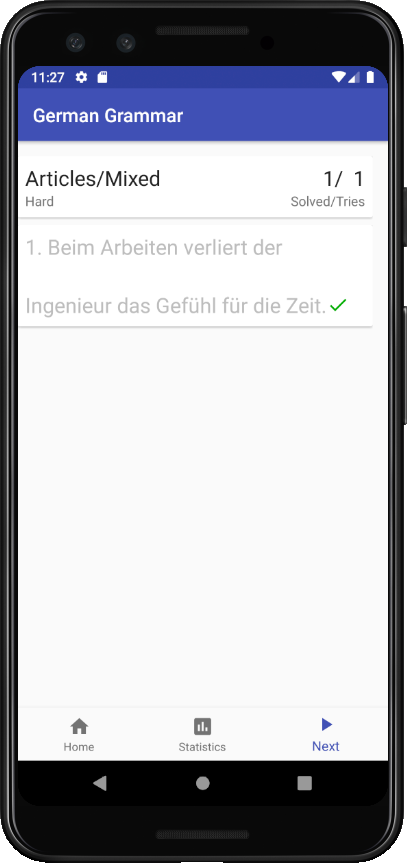

# German Grammar
Improve your German grammar with practical exercises.

## Screenshots of the application

## Exercise input format specifications

### Exercise description
Exercises are sentences written in natural language.
Words can be annotated with alternatives and hints.

Alternatives are specified in square brackets and are comma separated.
Hints are specified in curly brackets and are comma separated.

> Der[**Die,Das**]{**Nominativ,Singular,Maskulin**} Junge lernt und das[**die,der**]{**Nominativ,Plural,Neutrum**} Mädchen spielt.

### Hints for picking the correct solution

Hints can be provided for words with alternative.
The hints are provide information on the grammatical features of the word.
The allowed hints are grouped in the tables below.
A hint can contain any combination of at most one value of each table.
The *Alt* column contains the accepted German name (if empty, the parser accepts no German spelling).

|Case|*Alt*|
|---|---|
|Nominative|Nominativ|
|Accusative|Akkusativ|
|Dative|Dativ|
|Genitive|Genitiv|

|Category|*Alt*|
|---|---|
|Punctuation||
|Pronoun||
|PrepositionTemporal|Temporal|
|PrepositionLocal|Lokal|
|PrepositionModal|Modal|
|Noun||
|Verb||
|Adj||
|Adv||

|Gender|*Alt*|
|---|---|
|Masculine|Maskulin|
|Feminine|Feminin|
|Neuter|Neutrum|

|Numbering|
|---|
|None|
|Singular|
|Plural|

Examples: `{Singular,Noun,Feminine}`, `{Pronoun,Plural}`.

### Importing exercises
In order to be imported, the exercises must be specified in a `CSV` file.
The columns are separated by `TABS`.

|**action**|Description|
|---|---|
|update|The exercise must be added or updated in the Database|
|delete|The exercise must be removed from the Database (maybe it was wrong?)|

The **sid** is a string used to uniquely identify the exercise.
Having two exercises with the same sid will cause one of the two exercises to be overwritten.
Please keep sid values unique.

The **tag1**, **tag2**, **tag3** columns are used to help categorize the exercise.
Buttons with the provided combinations of tags will be generated in the main menu automatically in order to allow access to any new exercises.

The **difficulty** is a numeric value from 1 (easy) to 9 (hard).
The difficulty of the exercise will be displayed in to the user in the application.

The **text** contains the text of the of the exercise,
with the alternatives and the hints.
Note that it is possible to group multiple texts for the exercises by leaving all the columns (except the text column) empty.
See **my_id01** below for an example of grouping two texts in one exercise.

The **translation** is optional and not used yet.

### Example of an .csv

[example.csv](example.csv)

|action|sid|tag1|tag2|tag3|difficulty|text|translation|
|---|---|---|---|---|---|---|---|
|update|my_id01|Articles|Nominative||1|Die[Das,Der]{Nominativ,Singular,Feminin} Mutter kocht und die[der,dem]{Nominativ,Plural,Neutrum} Kinder kaufen ein.||
||||||1|Der[Die,Das]{Nominativ,Singular,Maskulin} Junge lernt und das[die,der]{Nominativ,Plural,Neutrum} Mädchen spielt.||
|update|my_id02|Articles|Accusative||2|Die[der,das]{Nominativ,Singular,Feminin} Tür macht ein[eine,einer]{Akkusativ,Singular,Neutrum} komisches Geräusch.||
|update|my_id05|Articles|Accusative||2|Wer tut dem[der,das]{Dativ,Singular,Maskulin} Lehrer einen[einem,eines]{Akkusativ,Singular,Neutrum} Gefallen?||
|update|my_id07|Articles|Nominative||3|Ein[Eine,Eines]{Nominativ,Singular,Maskulin} Tag ist wie der[die,dem,das]{Nominativ,Singular,Maskulin} andere.||
|update|my_id08|Prepositions|||2|Das Kind geht nicht aus[bei,während]{lokal,Dativ} dem Haus ohne[statt,mit]{modal,Akkusativ} sein Spiel.||
